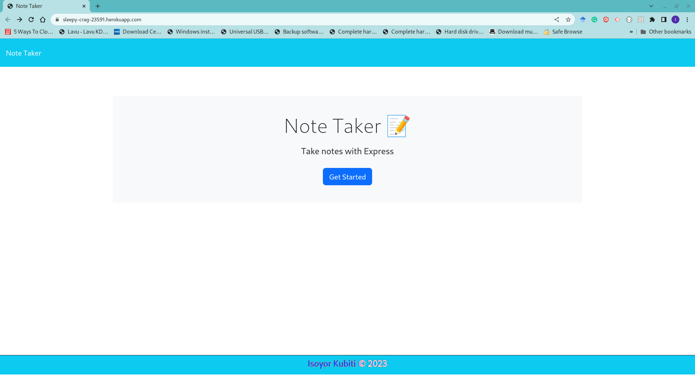
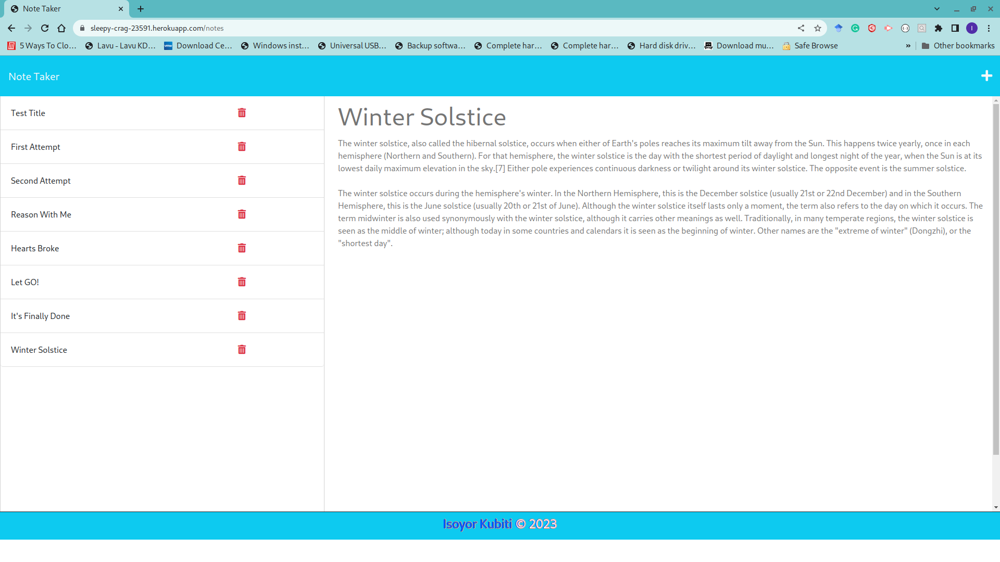
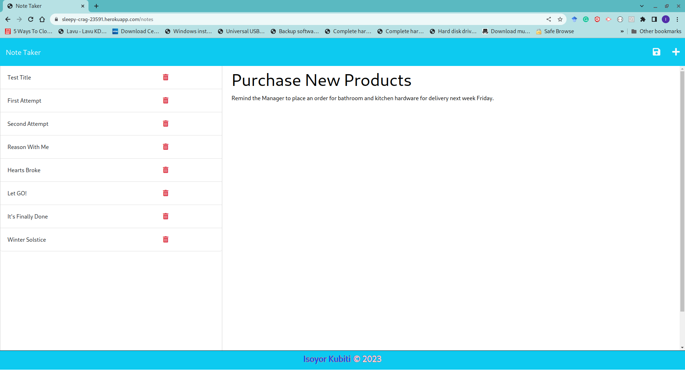
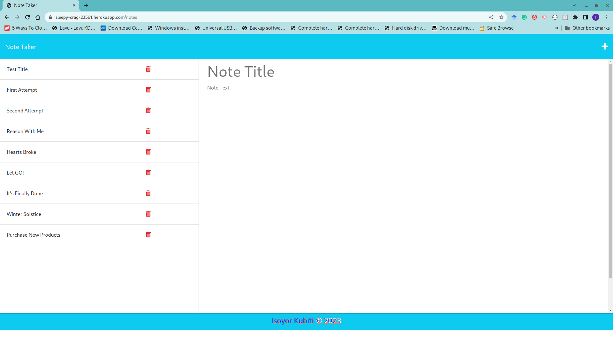
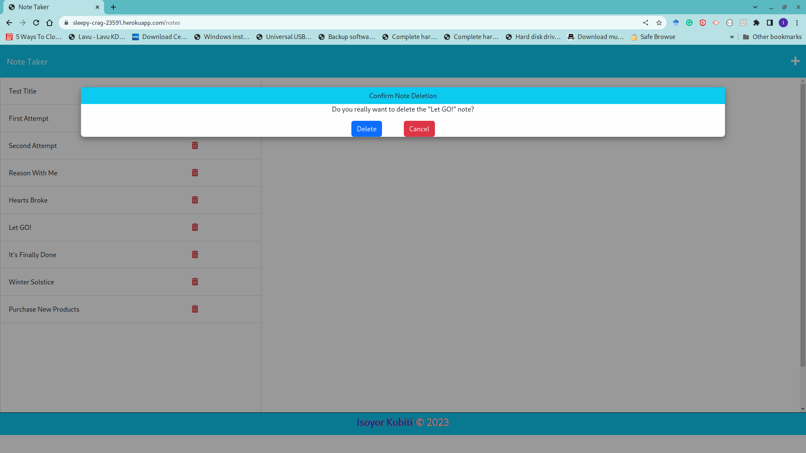
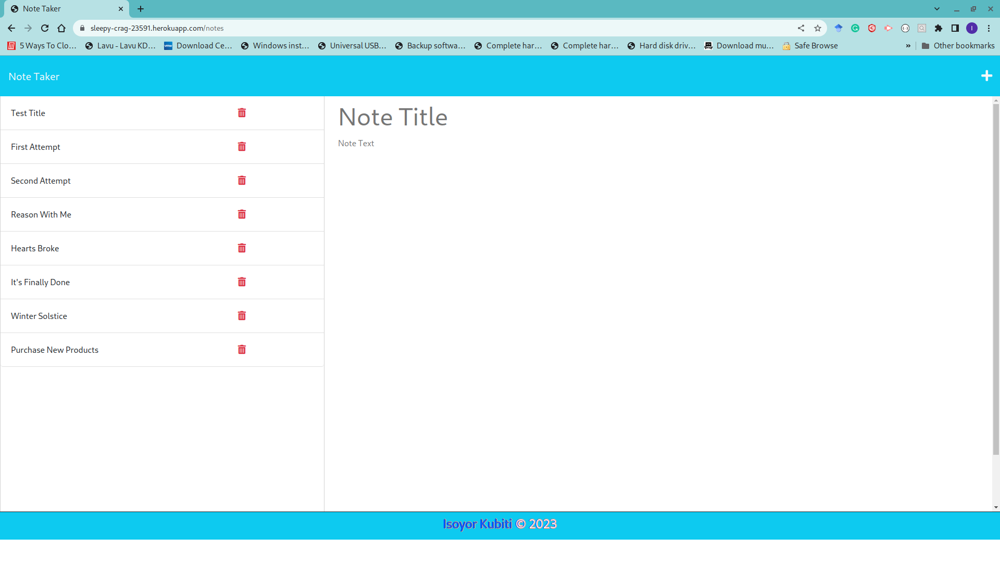

# NOTE TAKER

   

## Description

This application uses Node.js and Express.js to create Note Taker page that allows the user to write and save notes. The user can also view the notes in read-only mode and delete obsolete data. The application uses an Express.js back-end to save and retrieve its note data from a JSON file.

My objectives for this application is based on the following user story and acceptance criteria;

### User Story

```
As A small business owner
I want to be able to write and save notes
So that I can organize my thoughts and keep track of tasks I need to complete.

```

### Acceptance Criteria

```
Given a note-taking application

When I open the Note Taker
Then I am presented with a landing page with a link to a notes page.

When I click on the link to the notes page
Then I am presented with a page with existing notes listed in the left-hand column, plus empty fields to enter a new note title and the note's text in the right-hand column.

When I enter a new note title and the note's text
Then a Save icon appears in the navigation at the top of the page.

When I click on the Save icon
Then the new note I have entered is saved and appears in the left-hand column with the other existing notes.

When I click on an existing note in the list in the left-hand column
Then that note appears in the right-hand column.

When I click on the Write icon in the navigation at the top of the page
Then I am presented with empty fields to enter a new note title and the note's text in the right-hand.

```

## Table of Contents

- [Description](#description)
- [Installation](#installation)
- [Usage](#usage)
- [Features](#features)
- [Questions](#questions)
- [License](#license)

---

## Installation

To run this application as an end-user, please visit;

https://note-taker-express101.herokuapp.com/

## Usage

The Note Taker app is initiated by visiting the webpage below;

https://note-taker-express101.herokuapp.com/

The image below shows the landing page of the Note Taker app.



When user clicks the "Get Started" button, the application opens the Notes page of the app.


Once on the notes page, the user can view any existing note in read-only mode.



The user can click on the "+" sign on the right side of the navbar to add a new note. The note has title and description sections for the user to enter their notes. Once the user start to enter their notes, a save icon appears to allow saving the note on completion. The image below shows the user entering a unsaved note.



On completing adding a new note, the user clicks the save icon and the new note gets added to the list of existing notes.



The user may click on any note to delete. When the user clicks to delete a note, the application presents a modal for the user to confirm deleting the note. The user may confirm or cancel the delete request by clicking "Delete" or "Cancel" respectively.


Once a note is deleted, the Note Taker page displays the updated list of existing notes excluding the deleted note.



## Features

In addition to fulfilling the above requirements, the application also has the following features:

1.  The application adds the ability to delete notes.
2.  The application prevents accidental note deletion by asking for confirming to delete any selected note.

## Questions

If you have any questions, please feel free to reach out to me at: [ikubiti@icloud.com](mailto:ikubiti@icloud.com).

Alternatively, you may find my profile on GitHub at [https://github.com/ikubiti](https://github.com/ikubiti).

---

## License

Copyright (c) ikubiti. All rights reserved.

Licensed under the [MIT](./LICENSE) license.

